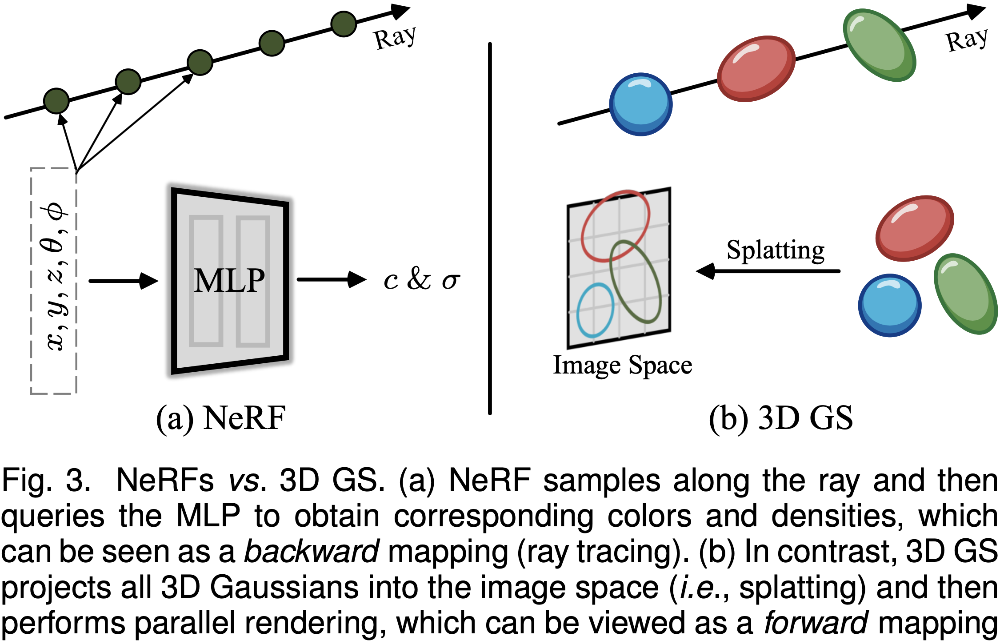

# 3D Gaussian Splatting Forward Pipeline

## Conceptual Definition

3DGS projects learned 3D Gaussians into 2D space, sorts them by depth, and alpha-blends their colors per pixel.

Each 3D Gaussian is defined by four core attributes:

* **Position** $\boldsymbol{\mu} \in \mathbb{R}^3$: The center position in world space.
* **Covariance** $\boldsymbol{\Sigma}_{3d} \in \mathbb{R}^{3 \times 3}$:
Defines the shape and orientation of the ellipsoid.
* **Opacity** $o \in \mathbb{R}$: Controls transparency (activated via sigmoid during rendering).
* **Color** $\mathbf{c} \in \mathbb{R}^3$: Parameterized by Spherical Harmonics (SH)
coefficients to support view-dependent shading.

3DGS extends the classic point cloud with anisotropic 3D Gaussians, view-dependent colors, and learnable opacity:

| Attribute | Point Cloud | 3D Gaussian Splatting |
| :--- | :--- | :--- |
| **Shape** | Isotropic (Dot) | Anisotropic (3D Ellipsoid) |
| **Color** | Static RGB | View-Dependent (SH Coefficients) |
| **Opacity** | Binary (Opaque) | Continuous (Learnable Alpha) |

---

## Rendering Pipeline

The rendering process transforms world-space Gaussians into a final 2D image
through four conceptual stages: **Projection**, **Tiling**, **Sorting**, and **Rasterization**.

### 1. Projection

Transform each 3D Gaussian from world space to screen space.

* **Compute 2D Mean:** Project $\boldsymbol{\mu}$ using the view-projection matrix.
* **Compute Conic:** Transform $\boldsymbol{\Sigma}$ to 2D screen space and
  invert it to obtain the conic coefficients $(a, b, c)$.
* **Evaluate Color:** Compute RGB values from SH coefficients based on the current view direction.

### 2. Tiling & Replication

Partition the image into $16\times16$ pixel tiles to enable localized, parallel processing.

* **Overlap Detection:** Determine which tiles each projected Gaussian intersects based on its 2D extent.
* **Replication:** For every intersected tile, emit a record containing `(tile_id, gaussian_id)`.

### 3. Sorting

Sort all emitted `(tile_id, gaussian_id)` pairs to enable correct alpha blending.

* **Composite Key Sort:** Sort records primarily by `tile_id` (spatial grouping)
  and secondarily by depth (front-to-back order).
* **Implementation Detail:** Achieved via a two-pass approach, first
  sorting by depth, then performing a stable sort by `tile_id`.

### 4. Rasterization

Render pixels in parallel using thread blocks assigned to specific tiles.

* **Traversal:** Each thread iterates through the sorted list of Gaussians associated with its tile.
* **Evaluation:** For each Gaussian, compute the contribution at the pixel
  location using the precomputed conic coefficients.
* **Alpha Compositing:** Accumulate color and opacity front-to-back.

---

## Data Structures

To ensure easy memory access during GPU kernels, all parameters are
stored in contiguous flat tensors.

### Input Attributes (`Splats::attributes`)

All $N$ Gaussians are packed into a contiguous `[N, 11]` tensor.

| Offset | Field | Components | Description |
| :--- | :--- | :--- | :--- |
| `0–2` | $\boldsymbol{\mu}$ | $(x, y, z)$ | Mean position in world space. |
| `3–6` | $\mathbf{q}$ | $(q_w, q_x, q_y, q_z)$ | Rotation quaternion (normalized). |
| `7–9` | $\boldsymbol{\sigma}_{log}$ | $(\sigma_x, \sigma_y, \sigma_z)$ | Log-scale. Actual scales: $s_i = e^{\sigma_i}$. |
| `10` | $o_{raw}$ | $o$ | Raw opacity. Sigmoid: $\alpha = \frac{1}{1 + e^{-o}}$. |

> SH coefficients are stored in a separate tensor (e.g., `[N, K, 3]`).

### Projected Output (`Splats::projected`)

After projection, each Gaussian yields a 9-float record stored in a `[N, 9]` tensor.

| Offset | Field | Components | Description |
| :--- | :--- | :--- | :--- |
| `0–1` | $\boldsymbol{\mu}'$ | $(u, v)$ | 2D screen-space mean (pixels). |
| `2–4` | $\mathbf{C}$ | $(a, b, c)$ | Conic (inverse 2D covariance). |
| `5–7` | $\mathbf{c}$ | $(r, g, b)$ | RGB from SH, offset by +0.5. |
| `8` | $\alpha$ | $\alpha$ | Activated opacity $\in (0, 1)$. |

---

## References

* [3D Gaussian Splatting for Real-Time Radiance Field Rendering](https://arxiv.org/abs/2308.04079)
* [A Survey on 3D Gaussian Splatting](https://arxiv.org/abs/2401.03890)
