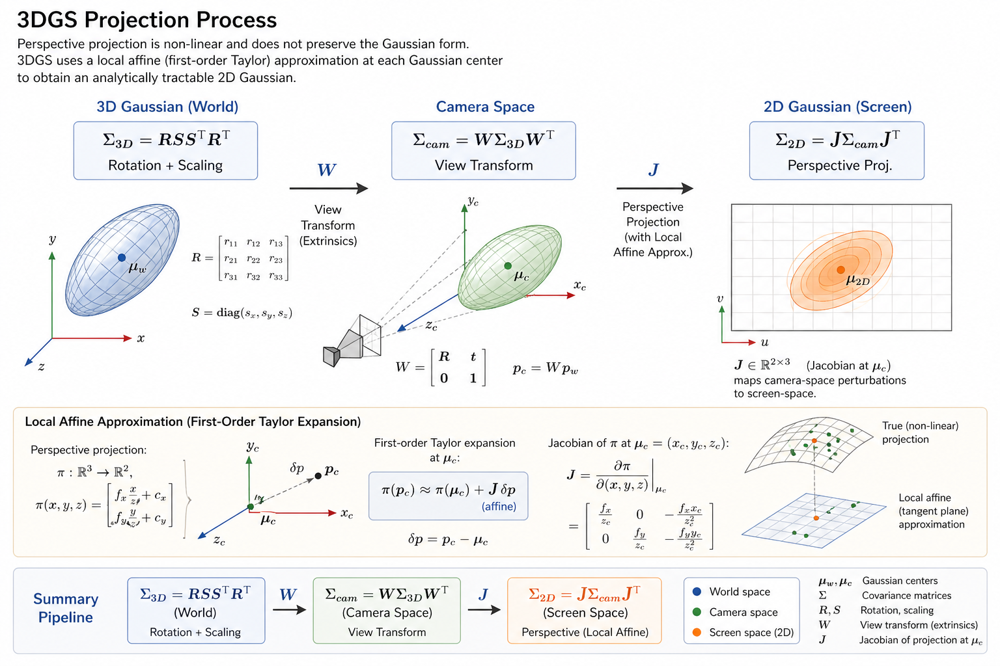
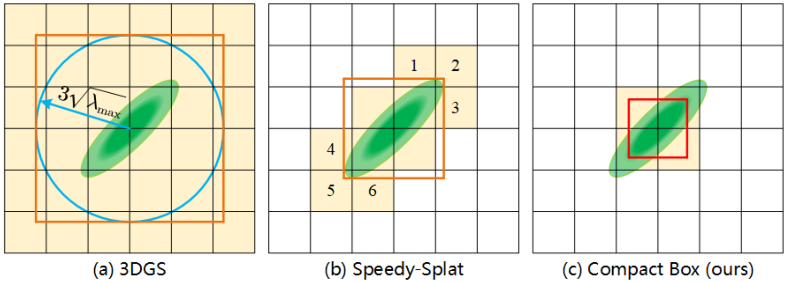

# Projection


*Generated by [ChatGPT Images 2.0](https://openai.com/index/introducing-chatgpt-images-2-0/)*

Transforms each 3D Gaussian from world space to screen space.
The key challenge is preserving the Gaussian form under perspective projection,
which is non-linear. 3DGS solves this via **local affine approximation**
(first-order Taylor expansion) at each Gaussian's center, making the projected
distribution analytically tractable.

```bash
3D Gaussian (World)           Camera Space                  2D Gaussian (Screen)
┌─────────────────────┐       ┌─────────────────────┐       ┌─────────────────────┐
│  Σ_3D = RSSᵀRᵀ      │  ──►  │  Σ_cam = WΣWᵀ       │  ──►  │  Σ_2D = JΣ_camJᵀ    │
│                     │   W   │                     │   J   │                     │
│  Rotation + Scaling │       │  View Transform     │       │  Perspective Proj.  │
└─────────────────────┘       └─────────────────────┘       └─────────────────────┘
```

---

## 1. 3D Covariance

Guaranteed positive semi-definite via the decomposition
$\boldsymbol{\Sigma_{3D}} = \mathbf{R} \mathbf{S} \mathbf{S}^T \mathbf{R}^T$.

Let $\mathbf{M} = \mathbf{R} \mathbf{S}$ where
$\mathbf{R}$ is the rotation from quaternion
$\mathbf{q} = (q_w, q_x, q_y, q_z)$:

$$
\mathbf{R} = \begin{pmatrix}
1 - 2(q_y^2 + q_z^2) & 2(q_x q_y - q_w q_z) & 2(q_x q_z + q_w q_y) \\
2(q_x q_y + q_w q_z) & 1 - 2(q_x^2 + q_z^2) & 2(q_y q_z - q_w q_x) \\
2(q_x q_z - q_w q_y) & 2(q_y q_z + q_w q_x) & 1 - 2(q_x^2 + q_y^2)
\end{pmatrix}
$$

and
$\mathbf{S} = \text{diag}(s_x, s_y, s_z)$ where
$s_i = e^{\sigma_i}$ (scales are stored as log-space values $\boldsymbol{\sigma}_{log}$
to ensure positivity):

$$
\mathbf{M} = \begin{pmatrix}
R_{00}s_x & R_{01}s_y & R_{02}s_z \\
R_{10}s_x & R_{11}s_y & R_{12}s_z \\
R_{20}s_x & R_{21}s_y & R_{22}s_z
\end{pmatrix}
$$

Then $\boldsymbol{\Sigma_{3D}} = \mathbf{M} \mathbf{M}^T$. Only the upper
triangle (6 values) is computed since $\boldsymbol{\Sigma_{3D}}$ is symmetric:

$$
\Sigma_{3D} = \begin{bmatrix}
\color{green}{\Sigma_{xx}} & \color{green}{\Sigma_{xy}} & \color{green}{\Sigma_{xz}} \\
\Sigma_{xy} & \color{green}{\Sigma_{yy}} & \color{green}{\Sigma_{yz}} \\
\Sigma_{xz} & \Sigma_{yz} & \color{green}{\Sigma_{zz}}
\end{bmatrix}
$$

### Eigendecomposition

Since $\Sigma_{3D} \in \mathbb{R}^{3 \times 3}$ is real, symmetric, and positive-definite,
it admits an orthogonal eigendecomposition:

$$
\Sigma_{3D} = U \Lambda U^T
$$

Where:

* $U = [u_1, u_2, u_3]$ is an orthogonal matrix whose columns are the **eigenvectors** of $\Sigma_{3D}$.
* $\Lambda = \text{diag}(\lambda_1, \lambda_2, \lambda_3)$ contains the **eigenvalues** (all $\lambda_i > 0$).

Because every eigenvalue is strictly positive, we can factor $\Lambda = \Lambda^{1/2} \Lambda^{1/2}$, yielding:

$$
\Sigma_{3D} = U \Lambda^{1/2} \Lambda^{1/2} U^T = (U \Lambda^{1/2})(U \Lambda^{1/2})^T
$$

By identifying $R = U$ and $S = \Lambda^{1/2} = \text{diag}(\sqrt{\lambda_1}, \sqrt{\lambda_2}, \sqrt{\lambda_3})$, we recover:

$$
\Sigma_{3D} = R S S^T R^T = R \Lambda R^T
$$

This decomposition describes how an isotropic unit sphere is first stretched into an axis-aligned ellipsoid by $S$,
then rotated into its final orientation by $R$.

---

## 2. 2D Covariance

The full projection from world-space covariance to screen space in a
single equation:

$$
\boldsymbol{\Sigma}_{2d} = \mathbf{J} \boldsymbol{\Sigma_{cam}} \mathbf{J}^T =
\mathbf{J} \mathbf{W} \boldsymbol{\Sigma_{3D}} \mathbf{W}^T \mathbf{J}^T
$$

where $\mathbf{W} = \mathbf{R}_{view}$ is the view rotation.
This factors into two stages:

### Camera Covariance

First rotate the 3D covariance into camera coordinates:

$$
\boldsymbol{\Sigma}_{cam} = \mathbf{W} \boldsymbol{\Sigma_{3D}} \mathbf{W}^T
$$

$$
\boldsymbol{\Sigma}_{cam} = \begin{bmatrix}
\color{green}{\sigma_{xx}} & \color{green}{\sigma_{xy}} & \color{green}{\sigma_{xz}} \\
\sigma_{xy} & \color{green}{\sigma_{yy}} & \color{green}{\sigma_{yz}} \\
\sigma_{xz} & \sigma_{yz} & \color{green}{\sigma_{zz}}
\end{bmatrix}
$$

### Jacobian of the Perspective Projection

The pinhole model maps a camera-space point $(x, y, z)$ to pixel
coordinates:

$$u = f_x \frac{x}{z} + c_x, \quad v = f_y \frac{y}{z} + c_y$$

Taking partial derivatives with respect to the camera-space coordinates:

$$
\mathbf{J} = \begin{pmatrix}
\frac{\partial u}{\partial x} & \frac{\partial u}{\partial y} & \frac{\partial u}{\partial z} \\
\frac{\partial v}{\partial x} & \frac{\partial v}{\partial y} & \frac{\partial v}{\partial z}
\end{pmatrix}
= \begin{pmatrix}
\frac{f_x}{z} & 0 & -\frac{f_x x}{z^2} \\
0 & \frac{f_y}{z} & -\frac{f_y y}{z^2}
\end{pmatrix}
$$

The $z$-column captures how depth variation shifts the projected
position — steeper at close range (small $z$), flatter at distance.

### Project to 2D

Apply the Jacobian to $\boldsymbol{\Sigma}_{cam}$:

$$
\boldsymbol{\Sigma}_{2d} = \mathbf{J} \boldsymbol{\Sigma}_{cam} \mathbf{J}^T
= \begin{bmatrix}
\color{green}{a} & \color{green}{b} \\
b & \color{green}{c}
\end{bmatrix}
$$

The rasterizer precomputes the **conic**
$\mathbf{C} = \boldsymbol{\Sigma}_{2d}^{-1}$
to evaluate Gaussian contributions without per-pixel matrix inversion
(see [02_rasterization.md](02_rasterization.md#2-per-pixel-evaluation)).

---

## 3. Screen-Space Extent & Tile Intersection

Once the 2D Gaussian is projected, we must determine which 16×16 pixel tiles
it overlaps. Rather than evaluating the Gaussian at every pixel, we compute a
conservative axis-aligned bounding rectangle from the 2D covariance.

### Visibility Threshold

The alpha of a Gaussian at offset $(\Delta_x, \Delta_y)$ from its projected mean is:

$$
\alpha = o \cdot e^{-\text{power}}
$$

where $o$ is the Gaussian's opacity and
$\text{power} = \frac{1}{2}\Delta^T \mathbf{C} \Delta$
(see [02_rasterization.md](02_rasterization.md#2-per-pixel-evaluation)).

A contribution below $\frac{10}{255}$ is near-invisible. Setting this as
the cutoff threshold:

$$
\alpha_{\min} = \frac{10}{255} = o \cdot e^{-\text{power}_{\max}}
$$

Solving for the maximum power:

$$
\text{power}_{\max} = \ln\left(\frac{o}{\alpha_{\min}}\right)
                    = \ln\left(\frac{o}{10/255}\right)
                    = \ln(25.5 \cdot o)
$$

This is the cutoff power at which the Gaussian fades to
invisibility.

### Axis-Aligned Bounding Extent

The full power expression (see
[02_rasterization.md](02_rasterization.md#gaussian-power)) is:

$$
\text{power} = \frac{1}{2}(a\Delta_x^2 + c\Delta_y^2) + b\Delta_x\Delta_y
$$

where $(a, b, c)$ are the conic elements $\mathbf{C} = \boldsymbol{\Sigma}_{2d}^{-1}$.
For a $2 \times 2$ symmetric matrix, the inverse expands to:

$$
a = \frac{\Sigma_{yy}}{\det(\boldsymbol{\Sigma})},
b = \frac{-\Sigma_{xy}}{\det(\boldsymbol{\Sigma})},
c = \frac{\Sigma_{xx}}{\det(\boldsymbol{\Sigma})},
$$

$$
\det(\boldsymbol{\Sigma}) = \Sigma_{xx}\Sigma_{yy} - \Sigma_{xy}^2
$$

Computing the exact elliptical boundary requires solving a general conic
equation. Instead, we derive a **conservative axis-aligned extent** by dropping
the off-diagonal term ($\Sigma_{xy} = 0$, which implies $b = 0$),
which overestimates the extent along each axis:

$$
\text{power} \approx \frac{1}{2}(a\Delta_x^2 + c\Delta_y^2)
$$

Along the $x$-axis ($\Delta_y = 0$), setting $\text{power} = \text{power}_{\max}$:

$$
\text{power}_{\max} = \frac{1}{2} \cdot a \cdot \text{ext}_x^2
\quad\Longrightarrow\quad
\text{ext}_x = \sqrt{\frac{2 \cdot \text{power}_{\max}}{a}}
$$

Substituting $\text{power}_{\max} = \ln(25.5 \cdot o)$:

$$
\text{ext}_x = \sqrt{\frac{2 \cdot \ln(25.5 \cdot o)}{a}}
$$

With $\Sigma_{xy} = 0$, the determinant simplifies to
$\det(\bold{\Sigma}) = \Sigma_{xx}\Sigma_{yy}$, so
$a = \Sigma_{yy}/(\Sigma_{xx}\Sigma_{yy}) = 1/\Sigma_{xx}$ and
$1/a = \Sigma_{xx}$. Substituting into the expression above,
the code uses the **covariance diagonal** directly:

$$
\text{ext}_x = \sqrt{2 \cdot \ln(25.5 \cdot o) \cdot \Sigma_{xx}}
$$

$$
\text{ext}_y = \sqrt{2 \cdot \ln(25.5 \cdot o) \cdot \Sigma_{yy}}
$$

This is the squared Mahalanobis distance at the cutoff power, using the
covariance diagonal as a bound. The extent grows with both opacity (higher
cutoff) and covariance (wider Gaussian).

### Tile Bounding Box

The extent defines a rectangle around the projected mean
$(\mu'_x, \mu'_y)$:

$$
\begin{aligned}
\text{min}_x &= \text{clamp}\left(\left\lfloor \frac{\mu'_x - \text{ext}_x}{W} \right\rfloor, 0, n_x\right) \\
\text{max}_x &= \text{clamp}\left(\left\lfloor \frac{\mu'_x + \text{ext}_x}{W} \right\rfloor + 1, 0, n_x\right) \\
\text{min}_y &= \text{clamp}\left(\left\lfloor \frac{\mu'_y - \text{ext}_y}{W} \right\rfloor, 0, n_y\right) \\
\text{max}_y &= \text{clamp}\left(\left\lfloor \frac{\mu'_y + \text{ext}_y}{W} \right\rfloor + 1, 0, n_y\right)
\end{aligned}
$$

where $W = 16$ is the tile width and $(n_x, n_y)$ is the tile grid dimensions.

The Gaussian emits one `(tile_id, gaussian_id)` intersection pair for every tile
$(t_x, t_y)$ in this range, where
$\text{tile}_{\text{id}} = t_x + t_y \cdot n_x$. Gaussians spanning many tiles produce
many intersections — this is the primary factor in intersection buffer sizing.

### Why the Conservative Bound?


*Taken from [FastGS](https://fastgs.github.io/)*

Dropping the off-diagonal term $b$ means the bounding rectangle may cover tiles
that the rotated ellipse doesn't actually reach. This wastes some intersection
entries but is safe — it never misses a contributing tile. An exact elliptical
bound would save memory but requires more compute per Gaussian.

## References

* [A Visual Exploration of Gaussian Processes](https://distill.pub/2019/visual-exploration-gaussian-processes/)
* [FastGS: Training 3D Gaussian Splatting in 100 Seconds](https://fastgs.github.io/)
