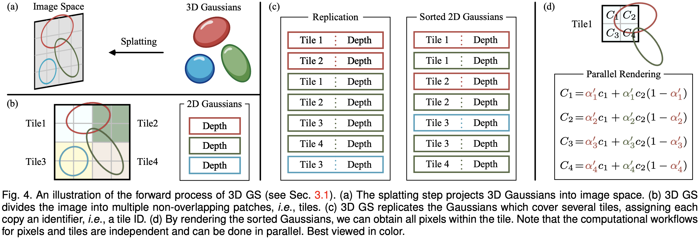

# Rasterization



Projects 2D Gaussians into a final RGBA image using tile-based,
front-to-back alpha compositing. Each pixel blends contributions from all
Gaussians covering it, ordered by depth (nearest first).

```bash
2D Gaussian (Screen)          Sorted Splats (Tile)          Rendered Pixel Color
┌─────────────────────┐       ┌─────────────────────┐       ┌─────────────────────┐
│ α = o·exp(-½dᵀΣ⁻¹d) │  ──►  │  z₁ < z₂ < ... < zᵢ │  ──►  │   C = Σ Tᵢ αᵢ cᵢ    │
│                     │ Bin   │                     │ Blend │                     │
│  Tile Binning       │       │  Per-tile sorting   │       │  Alpha compositing. │
└─────────────────────┘       └─────────────────────┘       └─────────────────────┘
```

---

## 1. Tile-Based Dispatch

The image is divided into $16 \times 16$ pixel tiles.
Each tile launches one GPU workgroup of **256** threads — one thread per pixel.

Using cubecl 2D dispatch (`CubeDim::new_2d(16, 16)`), positions are
available directly as builtins:

| Step | Builtin | Description |
|------|---------|-------------|
| Tile position | `(CUBE_POS_X, CUBE_POS_Y)` | Workgroup index = tile column / row |
| Tile ID | `CUBE_POS_Y * CUBE_COUNT_X + CUBE_POS_X` | Linear tile index |
| **Global pixel** | `(ABSOLUTE_POS_X, ABSOLUTE_POS_Y)` | Pixel coordinates |

Each tile has a precomputed range $[\text{start},\; \text{end})$ into the
sorted intersection list, giving the Gaussians that overlap this tile.

### 1.1 Example

```plain
8×8 IMAGE  →  2×2 Tile Grid
CubeDim(4,4)  CUBE_COUNT_X=2  CUBE_COUNT_Y=2

        Tile 0                    Tile 1
tile_id=0              tile_id=1
CUBE_POS: (X=0, Y=0)   CUBE_POS: (X=1, Y=0)
pixels: ABS_X 0~3      pixels: ABS_X 4~7
        ABS_Y 0~3              ABS_Y 0~3
┌────┬────┬────┬────┐ ┌────┬────┬────┬────┐
│ 0  │ 1  │ 2  │ 3  │ │ 0  │ 1  │ 2  │ 3  │
├────┼────┼────┼────┤ ├────┼────┼────┼────┤
│ 4  │ 5  │ 6  │ 7  │ │ 4  │ 5  │ 6  │ 7  │
├────┼────┼────┼────┤ ├────┼────┼────┼────┤
│ 8  │ 9  │ A  │ B  │ │ 8  │ 9  │ A  │ B  │
├────┼────┼────┼────┤ ├────┼────┼────┼────┤
│ C  │ D  │ E  │ F  │ │ C  │ D  │ E  │ F  │
└────┴────┴────┴────┘ └────┴────┴────┴────┘
┌────┬────┬────┬────┐ ┌────┬────┬────┬────┐
│ 0  │ 1  │ 2  │ 3  │ │ 0  │ 1  │ 2  │ 3  │
├────┼────┼────┼────┤ ├────┼────┼────┼────┤
│ 4  │ 5  │ 6  │ 7  │ │ 4  │ 5  │ 6  │ 7  │
├────┼────┼────┼────┤ ├────┼────┼────┼────┤
│ 8  │ 9  │ A  │ B  │ │ 8  │ 9  │ A  │ B  │
├────┼────┼────┼────┤ ├────┼────┼────┼────┤
│ C  │ D  │ E  │ F  │ │ C  │ D  │ E  │ F  │
└────┴────┴────┴────┘ └────┴────┴────┴────┘
        Tile 2                    Tile 3
tile_id=2              tile_id=3
CUBE_POS: (X=0, Y=1)   CUBE_POS: (X=1, Y=1)
pixels: ABS_X 4~7      pixels: ABS_X 4~7
        ABS_Y 0~3              ABS_Y 4~7
```

| Input `idx` | CUBE_POS_X | CUBE_POS_Y | tile_id | ABSOLUTE_POS_X | ABSOLUTE_POS_Y |
| :---: | :---: | :---: | :---: | :---: | :---: |
| **0** | 0 | 0 | 0 | **0** | **0** |
| **15** | 0 | 0 | 0 | **3** | **3** |
| **16** | 1 | 0 | 1 | **4** | **0** |
| **21** | 1 | 0 | 1 | **5** | **1** |
| **31** | 1 | 0 | 1 | **7** | **3** |
| **32** | 0 | 1 | 2 | **0** | **4** |
| **63** | 1 | 1 | 3 | **7** | **7** |

---

## 2. Per-Pixel Evaluation

For each Gaussian in the tile's sorted list, the renderer evaluates the
Gaussian's contribution at the current pixel.

### Conic

The **conic** $\mathbf{C} = \boldsymbol{\Sigma}_{2d}^{-1}$ is the inverse 2D
covariance (from [01_project.md](01_project.md#2-2d-covariance)).
It is precomputed per Gaussian so the rasterizer avoids a per-pixel matrix
inversion.

$$
\mathbf{C} = \boldsymbol{\Sigma}_{2d}^{-1}
= \frac{1}{ac - b^2}
\begin{pmatrix} 
c & -b \\ 
-b & a 
\end{pmatrix}
$$

### Gaussian Power

The 2D Gaussian PDF is:

$$
f(\mathbf{x}) = \frac{1}{2\pi|\boldsymbol{\Sigma}_{2d}|^{1/2}}
  \exp \left(-\frac{1}{2}\Delta^T\mathbf{C}\Delta\right)
$$

3DGS drops the normalization constant and folds the peak height into
**opacity** instead. The offset from the Gaussian's projected mean to the
pixel is:

$$
\Delta_x = \mu'_x - p_x, \quad \Delta_y = \mu'_y - p_y
$$

Expanding the quadratic form:

$$
\begin{aligned}
\text{power} &= \frac{1}{2}\Delta^T\mathbf{C}\Delta \\
             &= \frac{1}{2}\begin{pmatrix} 
             \Delta_x & \Delta_y 
             \end{pmatrix}
                \begin{pmatrix} 
                a & b 
                \\ 
                b & c 
                \end{pmatrix}
                \begin{pmatrix} 
                \Delta_x \\ 
                \Delta_y 
                \end{pmatrix} \\
             &= \frac{1}{2}(a\Delta_x^2 + c\Delta_y^2)
                + b\Delta_x\Delta_y
\end{aligned}
$$

* The **diagonal** terms $a\Delta_x^2$ and $c\Delta_y^2$ control the
  falloff along each axis — larger $a$ or $c$ means a tighter, sharper
  Gaussian in that direction.
* The **off-diagonal** term $b\Delta_x\Delta_y$ introduces the
  correlation between axes — this tilts/rotates the ellipse away from
  being axis-aligned. When $b = 0$ the ellipse axes are parallel to the
  pixel grid.

### Per-Gaussian Alpha

$$
\alpha = \min\Big(\text{opacity} \cdot e^{-\text{power}}, 0.999\Big)
$$

The $0.999$ cap prevents a single Gaussian from fully occluding everything
behind it. Gaussians with $\alpha < \frac{1}{255}$ are skipped entirely
(sub-pixel contribution).

---

## 3. Alpha Compositing

3DGS uses **front-to-back** volume rendering. The accumulated color at a
pixel is:

$$
C(\mathbf{x}) = \sum_{i=1}^{N} c_i \cdot \alpha_i \cdot T_i
$$

Where:

* $N$ is the number of Gaussians contributing to this pixel.
* $c_i \in \mathbb{R}^3$ is the RGB color of the $i$-th Gaussian.
* $\alpha_i \in [0, 1]$ is the opacity (alpha) of the $i$-th Gaussian at the pixel center.
* $T_i$ is the **transmittance** (or accumulated transparency) from the camera up to the $i$-th Gaussian.

Transmittance tracks how much light passes through all
previous Gaussians:

$$
T_i = \prod_{j=1}^{i-1}(1 - \alpha_j)
$$

### Iterative Update

Rather than computing the full product each step, the renderer maintains
running accumulators:

$$
\begin{aligned}
T &\leftarrow 1.0 \\
C &\leftarrow 0.0
\end{aligned}
\qquad
\text{for each Gaussian } i\text{:}
\quad
\begin{aligned}
C &\leftarrow C + c_i \cdot \alpha_i \cdot T \\
T &\leftarrow T \cdot (1 - \alpha_i)
\end{aligned}
$$

Gaussians are sorted nearest-first, so front surfaces accumulate first.
As $T \to 0$, subsequent Gaussians contribute vanishingly little
(implicit occlusion).

### Combined Form

Substituting $T_i$ back into the main equation, the full expansion looks like this:

$$
C = c_1 \alpha_1 + c_2 \alpha_2 (1 - \alpha_1) + c_3 \alpha_3 (1 - \alpha_1)(1 - \alpha_2) + \dots + c_N \alpha_N \prod_{j=1}^{N-1} (1 - \alpha_j) <!-- rumdl-disable-line MD013 -->
$$
